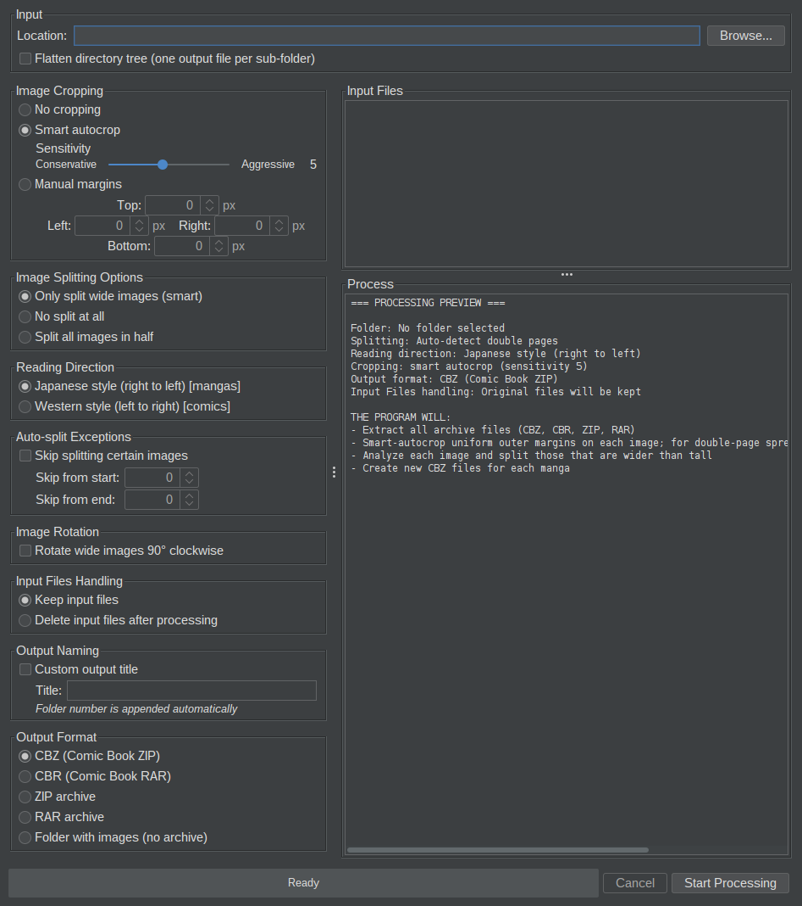

# MangaPagesSplitter

Transform a manga with 2 pages per image, into a manga with only one page per image.
Except if you want to keep the double-page spread format, then it is OK, you can simply batch create CBZ files, maybe rotate the images so you can read them in landscape mode etc.

This tool allows you to process transformations on your comics or mangas in batch, so you can read them more easily on your smartphone or tablet.

### Problem:
You have a bunch of mangas on your computer, but they are not in a format that is easy to read on a smartphone or tablet. For example, they are in the form of images, with 2 pages per image, and you have to zoom in and out to read them.

For example you have a manga made of images that look like this:

### Solution:
Use this program, and after a few clicks, your manga(s) will be transformed into a format that is easy to read on smartphones and tablets.

You get a manga made of images that look like this:

## The application
Everything happens in one window: pick a folder, choose the options on the left,
check the summary of what will be done, then start.

## Application's features:
- Can split all comics or manga's images vertically in half, and order pages properly.
  - Can skip a number of images at the start and end of the comic or manga.
- Can process multiple comics or mangas at once, as long as they are in the same directory.
- Comics or mangas can be in the form of a folder containing images, RAR, ZIP, CBZ or CBR files.
- Can automatically detect when to split an image or not, and even preserve special double-page spreads if they are in an otherwise single paged manga.
- Can automatically rotate double-page spreads 90 degrees clockwise.
- Can crop images before processing, either with fixed margins on all four sides or with **smart autocrop** (see below).
- Choose the output format: CBZ, CBR, ZIP, RAR, or a plain folder with images.
- Choose the reading direction: Japanese (right to left) or Western (left to right).
- Choose to keep or delete the original input files after processing.
- Supported image formats: JPG, JPEG, PNG, GIF, BMP, WebP.

## Smart autosplit
Turning a scanned double-page spread into two single pages is the core job, and
the default mode, **Only split wide images (smart)**, decides for each image
whether it is a spread at all:

- **Wide means spread.** An image wider than tall is cut into two pages; a
  portrait image is left alone. Pages are then renumbered in reading order, so
  any comic reader shows them in sequence.
- **Special spreads survive.** A wide artwork sitting among single pages, the
  kind meant to be admired as one picture, is recognised by its position and
  kept whole (and can be rotated to fill a portrait screen). A volume scanned
  entirely as spreads is split from the first page to the last.
- **Covers and inserts are excluded.** Tell it how many images to skip at the
  start and end of each volume, and those landscape covers, colour inserts and
  tables of contents are never cut.
- **Right or left first.** Pick *Japanese style* for manga (right page first)
  or *Western style* for comics.
- **Cuts on the seam** when smart autocrop is on: the split lands on the
  detected spine instead of the geometric middle, so off-centre scans do not
  leave a sliver of the neighbouring page on each half.

No pixel is resampled: each page is a plain sub-image of the original. The two
other modes are **No split at all**, when you only want cropping, rotation or
re-archiving, and **Split all images in half**, for volumes known to be all
spreads. The full rules are in [doc/autosplit.md](doc/autosplit.md).

## Smart autocrop
Scanned manga usually come with a white or black border around every page, and
double-page spreads are rarely centred on the seam, so cutting them at the exact
middle leaves a strip of the wrong page on each half. Smart autocrop fixes both
without you measuring anything:

- **Trims the scan borders** of every image. Each page is analysed on its own, so
  a volume where the margins drift from page to page still comes out clean, and
  pages without a uniform border (full-bleed art) are left untouched.
- **Finds the spine** on landscape spreads and cuts exactly on it, then trims the
  half-gutter that ends up on the inner edge of each new page. Every page fills
  the screen instead of showing a useless border on one side.
- **Protects details.** Thin elements that poke into the margin, like a sword
  handle or a speech bubble, stop the crop where they should instead of getting
  shaved off. Faint scanner smears hugging the edge are recognised and skipped.

Pick **Smart autocrop** in the *Image Cropping* panel and, if needed, move the
sensitivity slider: *Conservative* only trims very clean margins, *Aggressive*
ignores small low-contrast features and trims more. The default (5) suits most
scans. The processing log tells you what was trimmed on each image.

If you prefer fixed offsets, choose **Manual margins** instead and enter the
pixels to remove from each edge. The two modes are exclusive, so a leftover
manual value can never over-crop a batch by accident. Implementation details
are in [doc/autocrop.md](doc/autocrop.md).

## Flow
1. Select the root folder containing your mangas or comics. A preview of the files is shown (archives and folders are highlighted in green).
2. Configure the processing options: image cropping, splitting mode, reading direction, page exceptions, image rotation, output format, and whether to keep or delete original files.
3. Review the summary of what will be done in the Process pane.
4. Click "Start Processing". A real-time progress bar and log show the current status.
5. When processing is complete, a summary is displayed with the number of output files created.

## Limitations
- The program cannot handle RAR5 (RAR version 5) files directly. If it encounters this format, it will try to use WinRar or 7-Zip if it finds it on your computer, otherwise it will skip processing it.
- Creating RAR or CBR output files requires WinRAR to be installed. If WinRAR is not found, the program will fall back to creating a ZIP file instead.

## Implementation
This is a simple Java application.
Build and dependencies are handled by Maven.
### Dependencies
It is using Junrar (a third party library) in order to extract from RAR archives (if under version 5).

## How to use

### On Windows
#### Portable bundle (recommended, no Java required)
Download `MangaPagesSplitter-windows-<version>.zip` from the latest
[GitHub Release](https://github.com/flochrislas/MangaPagesSplitter/releases/latest),
unzip it anywhere, and double-click `MangaPagesSplitter.exe` inside the
extracted `MangaPagesSplitter` folder. The bundle ships with its own
Java runtime, so nothing else needs to be installed.
#### Batch file
You can use the batch file `MangaPagesSplitter.bat` from the latest [GitHub Release](https://github.com/flochrislas/MangaPagesSplitter/releases/latest) in order to run the program as a JAR file (you need `MangaPagesSplitter.jar` in the same directory) without typing any command (double click the batch file). You need Java 17 or newer installed on your system for this to work.
#### JAR file
You can enter the java command to run the JAR file from a console. You need Java 17 or newer installed on your system for this to work.

### On Linux
#### Bash script
You can use `MangaPagesSplitter.sh` from the latest [GitHub Release](https://github.com/flochrislas/MangaPagesSplitter/releases/latest) in order to run the program as a JAR file (you need `MangaPagesSplitter.jar` in the same directory). You need Java 17 or newer installed on your system for this to work.
#### JAR file
You can enter the java command to run the JAR file from a console. You need Java 17 or newer installed on your system for this to work.

Otherwise, you can simply compile the source code yourself and run it the way you like.
